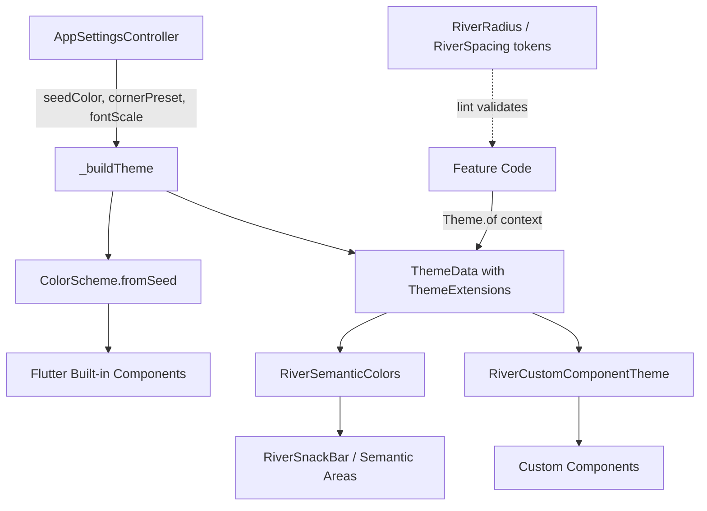

# Architecture Index — river UI 统一

## System Architecture

```
lib/core/theme/                    ← 新增：设计令牌 + 主题扩展
├── river_design_tokens.dart       ← 静态常量（RiverRadius, RiverSpacing）
├── river_semantic_colors.dart     ← ThemeExtension: 语义色彩
└── river_custom_component_theme.dart ← ThemeExtension: 自定义组件主题

lib/app/app.dart                   ← 修改：_buildTheme() 注册扩展
lib/core/widgets/                  ← 迁移：7 个核心组件引用令牌
lib/features/                      ← 迁移：9 个模块引用令牌
analysis_options.yaml              ← 新增：custom_lint 规则
codemagic.yaml                     ← 新增：lint CI 门禁
```

## Component Diagram



## Technology Stack

- Flutter ThemeData + ThemeExtension (built-in, no new dependency)
- custom_lint (dev_dependency, for lint enforcement)
- No new third-party packages

## Security

Not applicable — UI-only changes, no data handling impact.

## State Machine: Theme Configuration

```
[User opens Appearance Settings]
         |
    ┌────▼────┐
    │  View   │ ◄── reads: themeMode, seedColor, cornerPreset, fontScale, reduceMotion
    │ Current │
    └────┬────┘
         |
    ┌────▼────┐    user taps preset    ┌──────────┐
    │ Change  │───────────────────────►│  Apply   │
    │ Setting │                        │ Theme    │
    └────┬────┘                        └────┬─────┘
         │ user picks custom seed color     │
         │ or font weight                   │
         └──────────────────────────────────┘
                        │
                  ┌─────▼─────┐
                  │  Persist   │ ── SharedPreferences.setXxx
                  │  + Rebuild │ ── notifyListeners()
                  └─────┬─────┘
                        │
                  ┌─────▼─────┐
                  │ ThemeData  │ ── _buildTheme() re-evaluates with new
                  │ Rebuilt    │    seedColor/cornerRadius/fontScale
                  └───────────┘
```

## Configuration Model

| Field | Type | Default | Range | Persisted As |
|-------|------|---------|-------|-------------|
| `themeMode` | ThemeMode enum | ThemeMode.system | system/light/dark | int (index) |
| `themeSeedColor` | Color | Color(0xFF12457A) | ARGB 32-bit | int (toARGB32) |
| `cornerPreset` | AppCornerPreset | standard | compact(10)/standard(14)/relaxed(20) | int (index) |
| `fontScale` | double | 1.0 | 0.8-1.3 | double |
| `fontFamilyName` | String | "HarmonyOS Sans" | system fonts | string |
| `reduceMotion` | bool | false | true/false | bool |
| `fontWeightPreset` | AppFontWeightPreset | regular | regular/medium/bold | int (index) |
| `homeForumPreference` | enum | riverSide | riverSide/qingShuiHePan | int (index) |

## ADRs

| ID | Title | Status |
|----|-------|--------|
| ADR-001 | 混合令牌架构（静态常量 + ThemeExtension） | Accepted |
| ADR-002 | 渐进式模块迁移策略 | Accepted |
| ADR-003 | 语义色彩 Token 扩展 | Accepted |
