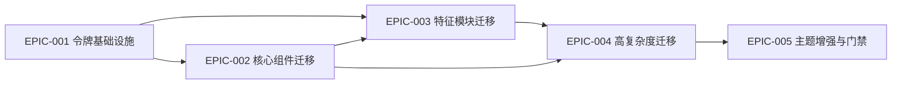

# Epics Index — river UI 统一

## Epic Overview

| ID | Title | Stories | Est. Size | MVP | Priority |
|----|-------|---------|-----------|-----|----------|
| EPIC-001 | 设计令牌基础设施 | 4 | 2 days | ✓ | P0 |
| EPIC-002 | 核心自定义组件迁移 | 5 | 4 days | ✓ | P0 |
| EPIC-003 | 特征模块迁移 (Wave 1-3) | 4 | 7 days | ✓ | P1 |
| EPIC-004 | 高复杂度模块迁移 (Wave 4-5) | 4 | 8 days | — | P1 |
| EPIC-005 | 主题增强与质量门禁 | 4 | 4 days | — | P2 |

## Cross-Epic Dependency Map

## MVP Scope
Epic 001-003: 令牌系统 + 核心组件 + settings/notifications/search 模块迁移。
MVP 交付后，80% 的用户交互表面（主页、通知、聊天、设置）已完成统一。

## Execution Order
1. EPIC-001 → 建立基础设施，零风险
2. EPIC-002 → 核心组件先行，建立迁移模式
3. EPIC-003 → 特征模块迁移，扩展到生产中
4. EPIC-004 → 最复杂模块，在模式验证后执行
5. EPIC-005 → 门禁和增强，防范回归
